# CSS

# 1. Boiler Plate of CSS (cascading style sheet)

### Bolier plate of CSS

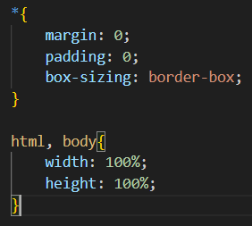

- *  refers to all
mens it denotes that this property should be applicable to all properties

- p<tag>

        it is element selector tag

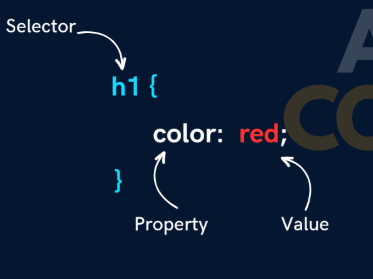

# 2. Types of CSS

### Types of CSS

- InLine CSS - High Priority

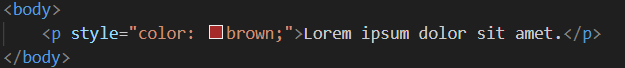

- Internal CSS- Medium Priority

     - in Internal CSS we need to mention properties inside the head in style 

  - and in body we need to write the actual content we want in the web page

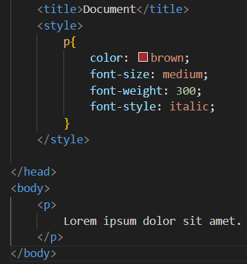

- External CSS- Low Priority

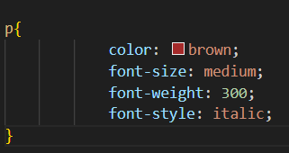

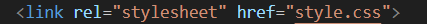

     - we need to mention these properties inside the css file 
and using link we have to attach these files

# 3. Properties of CSS

- width
- height
- font-size
- font weight
- color and background color
- units
- selectors
    -Universal
    
        - element
        - id
        - class
    

### Selectors in CSS

### Note-

- for class use ( . )
- for id use ( # )

### Class Selector

in HTMLand in CSS

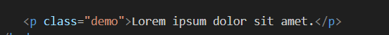

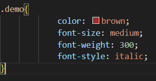

### ID Selector

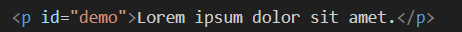

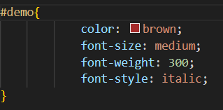

### Grouping Selector

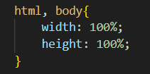

This is a Selector Used to Group in 2,3 

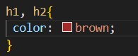

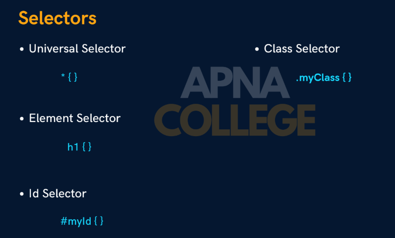

### Color and BackGround Color

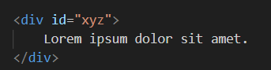

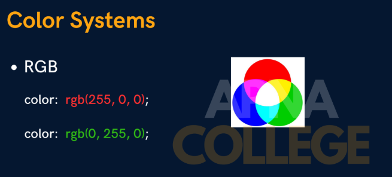

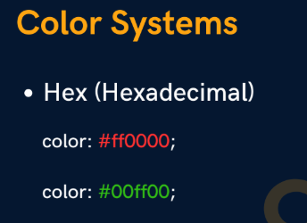

# 4. Units

- px
- %
- vh
- vw
- em
- rem

### 1. PX

- It is a defines pixels on the screen if we minimize the screen then also the px will not decreased

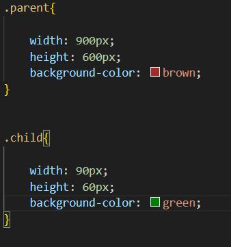

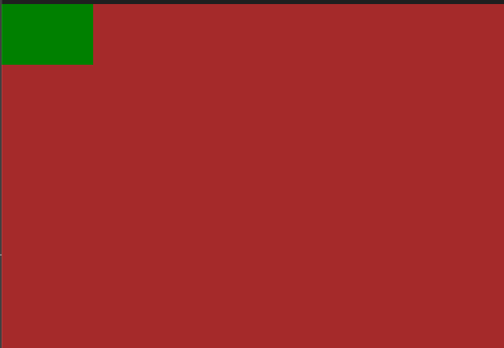

### 2. %

- When we minimize the screen then automatic the image of thext size will be decreased because it is in the % of parent
- % alwasy works with respect with child 

we cannot mention % in paren class

### 3. VH and VW

- **It takes data from parent ie body**
- if we mention 90% width and height in child class and your parent class if of ex 600 px then it will display 90% of the screen not of parent because it takes data from body

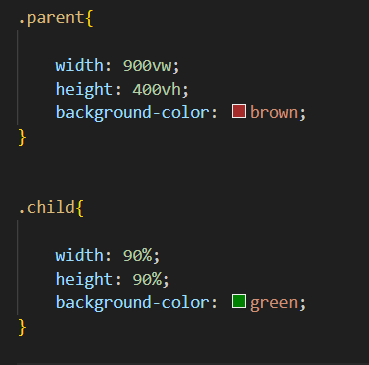

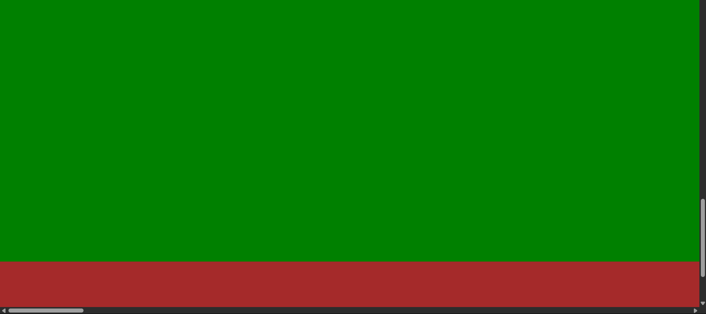

### 4. Em

- It takes data from parent font

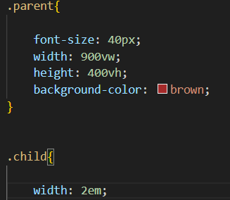

that em represents that 2 multiplied by element that is font size 

### 5. REM

takes data from parent 

# 5. Font Family

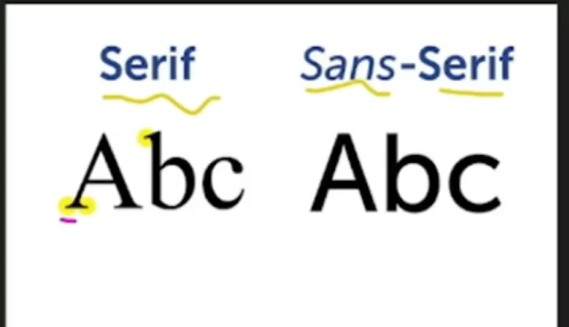

- Font with Sharp edges known as Serif
- Font with Non Sharp Edges is known as Snas-Serif

## Internal Fonts

.

## External Fonts

- for use of external fonts you only need to download that specific fonts form google fonts
- install that fonts and type the name of that font
and all set

### Font Properties

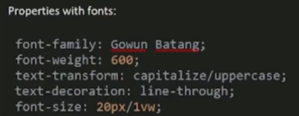

- Font Weight- it is used for making any text extra bold

- Text-transform    -1. capitalize - It used to make the first words of a line paragram in caps
    
                                     2. Upper Case- Make the Whole Statement in UpperCase
    
                               3. Lower Case - Make the Whole Text in lower Case  
    

- Text Decoration -  It is Used in many Context like Line Through is used foor cutting the word

- Font size - We can give it in pixel or vw 
but Suggesion is USe VW to make website more responsive

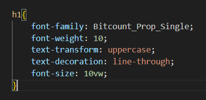

- Line Height  - It is Height between two lines the default line height is 1.2

- Text Align-  So it is used to align our text in 3 possible ways 
center , left , right

# 6. Pading, Margin and Border

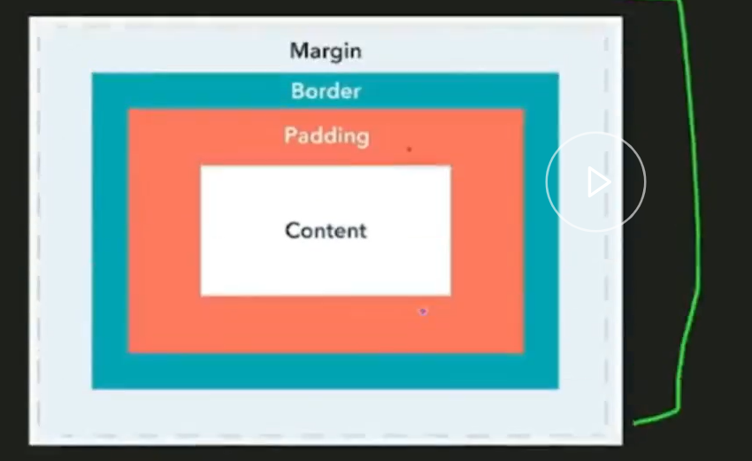

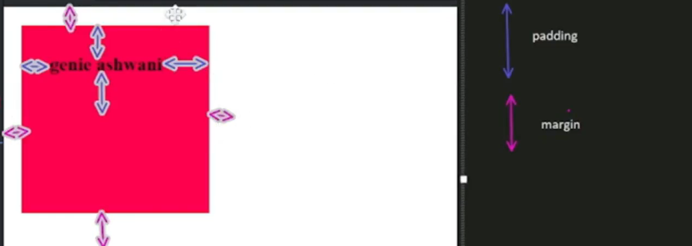

## Margin

- So basicalyy it gives some space between the sides of the page

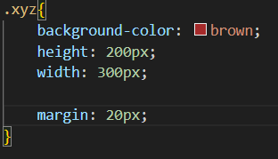

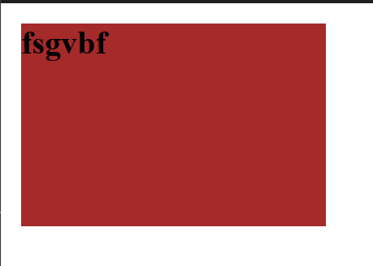

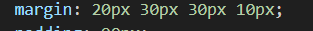

- so 4 px denotes for top, bottom, left & right

## Padding

- so Basically it adjust text inside the box

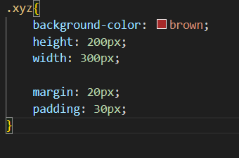

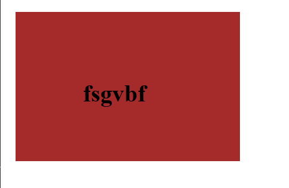

- so 4 px denotes for top, bottom, left & right

## Border

- There are 2 ways to apply border

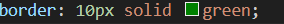

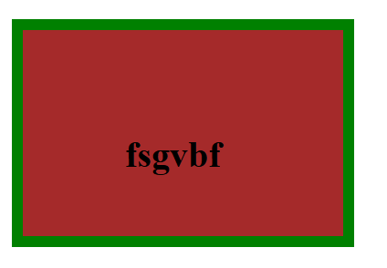

- 2nd Ways

# 7. Display

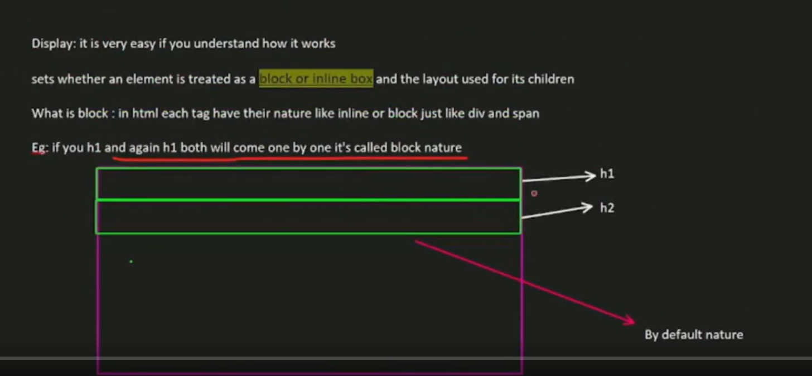

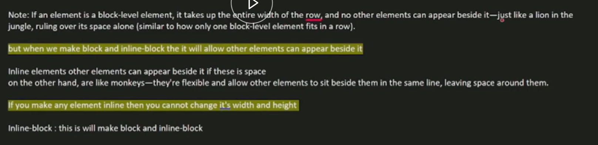

## In Short

1. Block-  so block will take one complete row like if we mention two h1s then one h1 is in one block and another h1 will be in another block

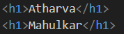

1. InLine-  Basically it is converting of block property into in sections means in one line both the h1s that is both the block will be occupied 

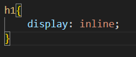

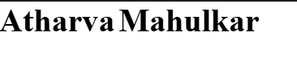

- Once we done it inline we are not able to change its height and width

Note-  If you are making any block inline then you are not able to change its width and height

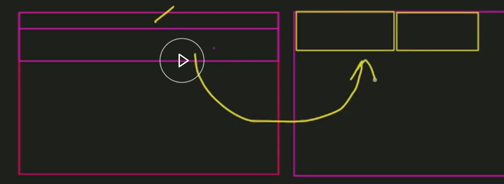

- We can also make the inline into block nature
ex- anchor tag is inline in nature

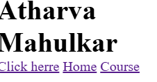

- here we didint apply any css but by default in come in one line because it has inline nature

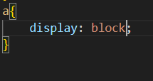

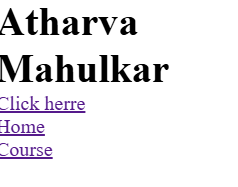

# 8. Position

## Absolute

- If we make any div Absolute then that block can move anywhere

### Normal Without absolute

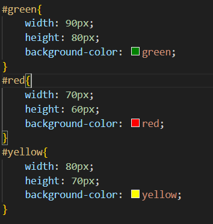

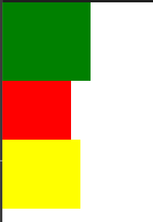

### With Absolute

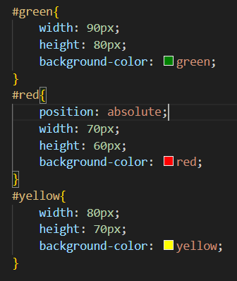

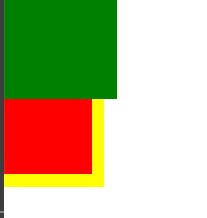

### After Moving

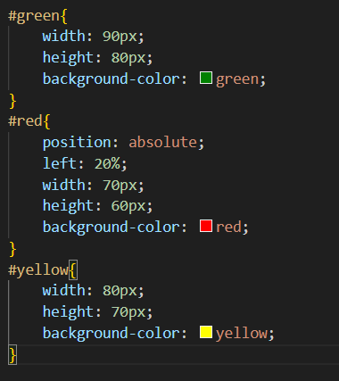

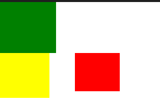

like that after making a div position absolute then we can move it anywhere

## Relative

- If we make two DIV one is parent and another one is Child
- if we make parent as relative and child as absolute 
then the child will be able to move only inside the parent div

### 1. If we donot declare parent div as relative

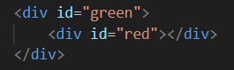

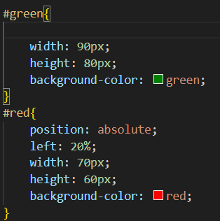

### 2. If we Declare parent div as a relative div

# 9. FLEX

- Basically Flex is almost similar to inline function the major difference is that flex provides us more control to convert the content side by side that is inline from the containt which is in block

NOTE- Flex is a property which is applied on parent not on child  

Here parent is container and child is element

### Before FlexBox

### After FlexBox

### Flex Direction

- we can decied the flex axis direction that is row left, right, reverse, etc

### Justify Content

- so Basically it alligns all the div containts where we wish to 
that is in center , left right .

- If we use justify content then it will conside the perpendicular axis that is axis parallel to rows, horizontal line on a div

### Align Item

- Here it consider the axis which line Vertical axis
- look at the pic and consider the axis

# 10. Pseudo Elements and Pseudo Class

- In CSS, both Pseudo Classes and Pseudo Elements are used to style specific parts or states of elements but they do it in a different way

### Pseudo Classes

- Pseudo classes are used to apply styles to an element based or its state or condition
state or condition like when an element is hovered over, focused, even its position relative to sibling

### Hover

### Focus

### For Paragraph

# Pseudo Elements

- These allow you to style specific parts of an element, like the first letter, first line, or even inserting new content before or after the element’s content
- In Pseudo Element :: is Used

### H1 After and Before

### Paragraph First Line

### Selection

Selected content get highlited 

