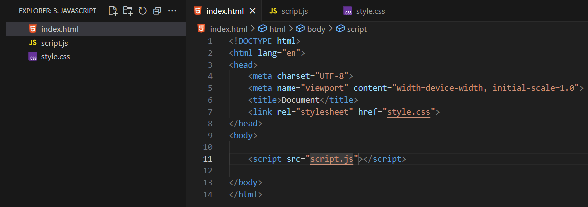

# JS

# A. Basic

- Basically JS is a Light Weight, Interpreted and Just In Time (JIT) Complied Prog Language
- It is Not a OOP language, it supports only few features of OOP
    - Interpreted : Refers to line by line translation
    - Complied : Translating entire code in one go

- JIT - So basically JIT Converts the Bytecode into native machine code at runtime for faster execution
    - for ex- if we run any JS Code on a browser, so what happens our code get compiled, run and deployed on a same time within the browser
    
- AOT- It is Ahead of Time used in current java Script Engines
    - so in this the process of load and compile is not done in browser it is done in application
    - means compiling byte code into native machine code before the program runs

### Use of Java Script

It is used as - 

- Client side : Using HTML
- Server side : Using Node JS
- Database : Using MongoDB

So this makes a JS programming language

- so we use JS as
    - For basic calculations like other programming lang (java)
    - For DOM Manipulation
    - Client side Validation
    - Server- Side
        - For Request
        - response
    
    ### How to Link JS in HTML
    
    
    
- Load JavaScript at the end of the body
It is Most preferable because it helps to load site faster comparatively to head

# B. Declaration

- In JS Instead of sout we use **console.log()**
- It is not compoulsory to use semicolon after declaration
we can use or can not use it

- console.warn() - It is used to Print Warning in the console
- console.error()- It is used to print error in the console


- windows.alert() - Used to Pop and Alert
    
                                  - It is a Functionality of Browser not of JS
    
    - we can also Apply alert as alert()
    - This is only one way communication
    
    
    

- windows.prompt() -It is Similar to alert but instead of showing message it take the input from user
    
                                       - It is also functionality of Browser not of JS
    
                                - we can also implement prompt using prompt()
    
                          - we can  also process the input which the input gave us with the help of Variables 
    


# C. Data-Types

- There are 2 types of container Var and Let
- While using VAR we do not need to define type of the variables
because JS decides it automatically on the basis of what we define in the var block

- Both Var and let used as containers for declaration of variables
- values of var and let can be changed after declaration of values 
but values of const cannot be changed after declaration

- Var - Don’t use it until you will not have legacy code
- Var is also accessible outside the block
- let- Let is Reassignable
means if we assigned it once, then we can also change it’s value


## i) Classification of Data-Types


### **1. Primitive-**

- String-

```python
let name = "Atharva";
```

- Number- using Var and Let

```jsx
//number using- var
var a=10
a=50;
console.log(a)
var is accessible outside the block

//number using let
let b=10
b=30
console.log(b);

//number using const
const k=10;
console.log(k);
onces a const is defined it cannot be changed
```

- Boolean using Boolean

```python
let isStudent = true;
```

- Null= assigning null to that variable
- Null is also a value, occur when Something Not Found

```python
let data = null;
```

- undefined- defining variable but do not give that variable any value
- Undefined Occur when we didn’t assign any values to variable

```jsx
var u;
console.log(u);
```


- **Big num-**

```python
Let bignum=123456n;
```

- **Symbol-**

```
let uniquekey=symbol(”UserId”)
```

### **2. Non Primitive-**

- Object - similar to java

```jsx
let student = {
  name: "Atharva",
  age: 20
};
```

- Array- Similar to java

```python
let numbers = [10, 20, 30];
```

- Function- Similar to java

```jsx
function greet() {
  console.log("Hello!");
}
```

**#NOTE-** How to find any declared variable is which type

```
console.log(typeof username)   // user name is a name of a variable
```

### **3. Reference Data Type-**

- [ ] - It is a Reference of a Array
        Happens when we define and array and do not initilize it
- ( ) - It is a reference of Method/ Function
    
           Happens when we do not define any thing under a function
    
- { }- It is a Reference of Object 
        Happens When we define an object and inside it we didn’t declare anything

```jsx
//Reference
//Array Reference
let arr=[];
console.log(arr)

//Function Reference
function gre(){
}
console.log(gre);

//object Reference
let obj={}
console.log(obj)
```


## ii) Difference Between Reference and Primitive types

### 1. In case of Primitive types

```jsx
var x=10;
var y=x;

y=y+2;

//x=10
//y=12

x=x+2

//x=12
//y=10
```

Primitive Data Types get Copied

- What happen here is exact copy of a x is created and it is assigned to y

### **2. In case of Reference (Array)-**

```jsx
var ex=[1,2,3,4,5];
arr1=ex 

arr1.pop()
console.log(ex)
console.log(arr1)

//output
[1,2,3,4]
[1,2,3,4]
```

- What Happens here when we Assigned a array to another array at that no other array is created instead of it give that array as a reference
- So when we change form one array it also get change from another array because that array is passed as a reference

**How to Avoid These (using Spread)-** 

- Use Spread
- When we Append one array to another array
inside a [… arr]
- using these we can avoid the change in the first array that is our original array when we change the element form the 2nd array
- So instead of passing Reference it make another obj and pass that object

```jsx
var ex=[1,2,3,4,5];
arr1=[...ex]

arr1.pop()
console.log(ex);
console.log(arr1);

//output
[1,2,3,4,5]
[1,2,3,4]
```

# D. Operators in Java-Script

```jsx
//Arithmetic operator
	+
	-
	*
	/
	%
	** - 10**4 (a to the power b) exponential 10^4
	
//Assignmnet Operator
	=
	+=
	-=
	/=
	%=
	
//Comparision Operator
	==   - it do not check type (10=="10")- gives true
	===  - it also checks the type (10==="10") - gives false
	!=
	!==
	(use === and !== insted of == & !=)
	<
	>
	<=
	>=

//Logical Operator
	&&
	||
	
//Unary Operator
	typeof
	!
	++
	--
	
//Ternary Operator
	? true: false   - let canvote=(age>18) ? "Yes" : "No";

//Bitwise Operator
	&
	
//String Concatenation
	+
	+=
	
//hardcoded
	let s=`Hello ${fname} welcome to the class`
```

# E. Conditionals in Java-Script

## i. If-Else-

- It is similar to java but the difference is js consider many of the things as true 
so in if condition instead of passing true statements passe the conditions which is false

```jsx
//if else

    if(null){
        console.log("Hi");
    }
    else{
        console.log("Hello");
    }

    //What are the things js consider as False
    null
    undefined
    0
    NAN- //not a number
    '' - //any thing in single quote
    " "- //Any thing in double quote
    document.all 
```

## ii. Switch

```jsx
//Switch
let day = 2;

switch(day){
    case 1:
        console.log("Monday");
        break;
    case 2:
        console.log("Tuesday");
        break;
    case 3:
        console.log("Wednesday");
        break;
    default:
        console.log("Invalid Day");
}
```

## iii. Ternary Operator

```jsx
//Ternary Operator

let age = 18;
let result = (age >= 18) ? "Adult" : "Minor";
console.log(result);  // Adult

let marks = 80;
let grade = 
    marks >= 90 ? "A" :
    marks >= 75 ? "B" :
    "C";
console.log(grade);
```

# F. Loops

## i. For Loop

```jsx
for(let i = 1; i <= 5; i++){
    console.log(i);
}
// Output: 1 2 3 4 5
```

## ii. While Loop

```jsx
let i = 1;
while(i <= 5){
    console.log(i);
    i++;
}

// Output: 1 2 3 4 5
```

## iii. Do-While Loop

```jsx
let num = 1;
do{
    console.log(num);
    num++;
}
while(num <= 5);

// Output: 1 2 3 4 5
```

## iv. For-Each Loop

```jsx
//forEach loop
let arr = [10, 20, 30];
arr.forEach(
    data=>{ console.log(data);
    }
)
// Output:
10
20
30
```

```jsx
let arr1 = [10, 20, 30];
arr1.forEach(function(value, index){
    console.log("Index:", index, "Value:", value);
});

// Output:
// Index: 0 Value: 10
// Index: 1 Value: 20
// Index: 2 Value: 30

```

# G. Functions

- Function in JS are different form java here we don’t need to give return type and a parameter type (We can pass anything in it)

```jsx
//in java
String print(String a){
    sout
}

//in JS
function print(a){
    console.log(a);
}
print(); //calling
```

**Note-**

- In JS we consider function as a value

- In ES5 (Older version) we have 3 types of Function
    - Function Statement (Normal Function)
    - Function expression
    - Anonymous Function
    
- In ES6 (Newer Version) we can write same function in 3 types
    - Fat Arrow Function
        - basic fat arrow
        - fat arrow with one param
        - fat arrow with implicit return

#Note- In JS function with no return is actually return undefined

## 1. Function in ES5

### i) Function Statement (Normal Function)

---

```jsx
function print(){
    console.log("Hello");
}
print()

function printa(name){
    console.log("Hello :"+name);
    return "Hello jii";
}
var a=printa("Atharva");
console.log(a);

//output
Hello
Hello :Atharva
Hello ji
```

- In these upper ex 2 if we didn’t return any thing and still holds the obj in a 
and print a 
then output of a will be undefined
- In Industry we use majorly

### ii) Function Expression

---

```jsx
var func=function(){
    console.log("Hello");
}
func()
```

- In these type we hold the function in one variable and that variable is also used as name for that function
- In these function type we do not give function name in right side, instead we consider the name which is given in left side as our function name

### iii) Anonymous Function

---

```jsx
var add = function(x, y) {
    return x + y;
	};

console.log(add(5, 3)); // Output: 8
```

- This is a Type of Function without any name

## 2. Functions in ES6

### i) Basic Fat Arrow Function

```jsx
var fun= ()=>{
    console.log("This is basic fat arrow Function");
    
}
fun()// calling
```

### ii) Fat Arrow with one param

```jsx
var fun1= (parameter)=>{
    console.log(parameter);
    
}
fun1(20);
```

### iii) Fat Arrow with implicit Return

```jsx
var fun2= ()=>{
    return "Atharva"
}
var ret=fun2();
console.log("hello "+ret);

var fun3= ()=> "Atharva"
var ret1=fun3();
console.log("Hello "+ret1);
```

### iv) Call back Function

- It is a Function which is passed as an argument to another function
- It is a function which is pass in another function, so another function can call it later
- so basically call back function is a function is a just a function that you can pass to another function

- Parameter- when we Define

```jsx
function add(a, b){
console.log(a + b);
}
```

- Argument- when we call
    
    ```jsx
    add(10, 20);  
    ```
    

```jsx
function hello(name){
    console.log(`Hello, ${name} welcome to coffee shop`    );
    
}
function getCustomer(callback){
    const name="Atharva";
    callback(name);  //calling the passed function
}
getCustomer(hello);

//output
Hello, Atharva welcome to coffee shop
```

### v) Nested Function

- Function inside a function

```jsx
function outerFunction() {

    let outerVar = "I am from outer function";

    function innerFunction() {
        console.log("Inner Function Running");
        console.log(outerVar);   // inner function can access outer variable
    }

    innerFunction(); // calling inner function
}

outerFunction();

//output
Inner Function Running
I am from outer function
```

# H. Array in JS

- In JS, Array is a Collection of data, but in JS we can store Homogenous values in array
i.e it is of strong type

```jsx
//define
var arr=[1,2,"Atharva", function(){}];

//acess
console.log(arr[2]);

//replace
arr[0]=20;

//length
console.log(arr.length);
```

### i) Methods in Array

```jsx
	//push()- add element to end of the aary
	
	//pop()- remove element from last
	
	//shift()- remove first element from the array 
	
	//indexOf() - get index of the number
	
	//join()- join all elements into string
	
	//slice() - Extract part
	
	//Splice()- it remove, replace and add elelment to array
	
```

### ii) Shopping cart mini Project using Array in JS

```jsx
//Initilization of empty array
let cart=[];

//add items
	cart.push("T-Shirts");
	cart.push("Shoes");
	cart.push("Watch");
	
console.log("cart item: ", cart);

//removing item
let popItem=cart.pop();
console.log("pop Item", popItem);
console.log("cart Item", cart);

//index wise cart
cart.foreach((item,index)=>{
	console.log(`${index+1}....${item}`);
});

//check if specif item is present or not
if(cart.includes("shoes")){
	console.log("yes");
}
else{
console.log("No");
}

//write a function to remove value which passes in parameter 
function removeItem(itemName){
	item=cart.filter(function(item){
		return item!==itemName;
	})
}
removeItem("Shoes");
console.log(cart);
```

# I. Strings in JS

```jsx
//Dynamic String - Define 

let name="Atharva";
let msg=`Hello Mr ${name}`;
console.log(msg);

//get the specific index
let a="Hii I am Atharva";
console.log(a[1]);
//output - i
```

### i) Methods in Strings

```jsx
.length

.toUpperCase()

.toLowerCase()

.includes()

.indexOf()

.trim()

.slice(start, end)
```

## ii) Updation in String

- Strings are mutable
- you can not change char directly in string, only reassignment of whole string is possible

```jsx
let name="Atharva"

name[2]="a"; // Not possible

name="Diya" // Possible
//here new string will be created insted of changing the existing string 
```

### iii) Type Conversion

```jsx
let s=1000;
let t=String(s);

let num=Number("77")  // converted into number 77

	let bool=Boolean("Hello")  // true 
```

### iv) String mini Project

```jsx
let fullname="     AtHArVA mAhUlKAr    ";

//remove spaces
fullname=fullname.trim();  //remove extra spaces

//to lower and split
let nameSlipt= fullname.toLowerCase().split(/\s+/);   //converting to array
//[atharva, mahulkar]  / we write our conding in this block  /       \s+ : define split from space

//capatilize each part
function toTitleCase(s){
return s[0].toUpperCase()+s.slice(1);
}

let fname=toTitleCase(nameSlipt[0]);
let lname=toTitleCase(nameSlipt[1]);

```

# J. Objects in JS

- An object is a collection of key-value pair
- It is a Group of related data

### i) Defining and Accessing, Updating, Deleting

```jsx
var obj={};
var obj1=new Object();

var obj={
    name: "Atharva",
    age: 20,
    email:"atharvamahulkar12@gmail.com",
    contact:" 8600511467"
}
//Dot Notation
console.log(obj.contact);

//Bracket Notation
console.log(obj["age"])

//Updation
obj.name="Raj";

//Add
obj.adder="Pune;"

//delete
delete obj.adder;
```

- There are these 3 methods by which we can make the Object

### ii) Nested Object

```jsx
const user={
    name: "Raj",
    adder:{
            city:"Pune",
            state: "Maharashtra"
    }
};

console.log(user.adder.city);
```

### iii) Function inside Object - Method

```jsx
var obj3={
    name:function(){
        console.log(this);  //This.age
    }, 
    age: 25
}
obj3.name();
```

### iv) For loop for Accessing object

```jsx
//1
for(let key in user){
    console.log(`${key}: ${user[key]}`);
    
}
//2
Object.keys(user).forEach(key)=>{
    console.log(`${key}: ${obj[key]}`);
}
//3
Object.values(user).forEach(v=>{
    console.log(v);
    
})

```

# K. This Keyword in JS

- In java this refers to the current object instance
- But in JS this value is different at different places
- Because in JS Current instance is not define 
because this is going to load in browser so according to condition, current instance changes
    - In Global - Window will be the scope
    - In Function - Window will be the Scope
    - In method- object will be the scope
    - function inside method (ES5)- Window is a Scope
    - function inside the method (ES6)- Object will be the scope
    - Constructor- new Blank object
    - Event Listener - That Element jispe Listener laga hai

### 1. Inside Global

```jsx
console.log(this);

//output
Window {window: Window, self: Window, document: document, name: '', location: Location, …}
```

### 2. Inside Function

```jsx
function print(){
    console.log(this);
    
}
print();

//output
Window {window: Window, self: Window, document: document, name: '', location: Location, …}
```

### 3. Inside Method

#Difference Btwn Function and Method

**Function-** 

```jsx
function print(){
    console.log(this);
    
}
```

**Method-** In JS We can say method which is inside object

```jsx
var obj3={
    name:function(){
        console.log(this);  //This.age
    }, 
    age: 25
}
obj3.name();
```

### 4. Function Inside Method ES5

```jsx
var obj1={
    parent:function(){
        function child(){
            console.log(this);
        }
        child();
    }
}
obj1.parent()

//output
Window {window: Window, self: Window, document: document, name: '', location: Location, …}
```

### 5. Function Inside method ES6

```jsx
var obje={
    name: function(){
        var child=()=>{
            console.log(this);
            
        }
       child() 
    }
}
obje.name();

//output
*{name: ƒ}*
```

### 6. Constructor

```jsx
function pair(){
    console.log(this);
    
}
var objec=new pair();
console.log(objec);

//Output
pair {}
	pair {}
```

- If we place new inform of method name while calling that methods then at that time this inside the method will refer that new object which is created

### 7. Even Listener

```jsx
//in html
 <button>click</button>
 
 //in Js
document.querySelector("button")
.addEventListener("click", function(){
    console.log(this);
    
})
//in Event Listner this points to that on which this is applied 

//output
```


# L. Call- Apply - Bind

**Call-**Through Call we can change ‘this’ value in function
             means whatever the values are coming like window, obj of this we can change that  

```jsx
var objx={
    name:"Atharva"
}
function printf(){
    console.log(this);
    
}
printf.call(objx);

//output
{name: 'Atharva'}
```

- so using call we can change the value of this
- Print ko call kro object ko pass kr ke

**Apply-** In Apply we can also pass the parameters

- It is Kind of Similar to call we can change the value of this 
but in apply we can pass parameters also

```jsx
var obx={
    name:"Atharva"
}
function prx(x,y,z){
    console.log(this, x, y, z);

}
prx.apply(obx, [1,2,5]);

//output
{name: 'Atharva'} i 1 2 5
```

**Bind-** It is also exact similar as call
            but the major difference is we will store that value in the variable 

```jsx
var ox={
    name:"Atharva"
}
function px(){
    console.log(this);
    
}
var func=px.bind(ox);
func();

//output
{name: 'Atharva'}
```

- Print ko bind kr do function se object pass kr ke aur function me hold kr lo
    
    ## i) Closures in JS
    
- A function which return one function using some value of it’s parent is called closure
- A function which runs after the execution of return statement

```jsx
function prnt(){
    var p=10;
    return function child(){
        p++;
        console.log(p);
        
    }
}
var func=prnt();
func()

//output
11
```

# M. Async-await

- In java we use thread to achieve/perform multiple tasks at a same time
and JS is not a multi threaded language
- In JS what happens is Main() thread is performing all tasks and one task is appear which take 10 min to complete
then it analyze that before 10min can it complete another task
- If it can complete then, it will complete that task before that 10 min task 
and send that 10 min task to background
- and at the end , it join that 10min task form the background
- For That purpose we have **Async-Await**


```jsx
async function demo(){
	return "Hello"
}

//so this Async will not return string it returns the object of promise
//which ensures that it will give response/object in future when ever needed

//that Response will be resolve or reject
```

- **Promise-**  promise means it is an object which will give response in future
for a reference we will use callable interface of LOCK in multithreading
it will also give response after the completion of time, gives future object

- Same here promise also gives response of future object after completion of main thread

```jsx
async function demo(){
	return "Hello";  // when we apply async before any fuction then it will convert that function response/ output to promise's response

	//return new Promise.resolve("Hello");   -- This happens Internally
}

console.log("Start");
demo();
console.log("End")
//means JS convert that response into promise response
```

- **Async-Await**

```jsx
asynch function wait3sec(){
	console.log("Waiting 3 sec..");
	await new Promise(resolve=> setTimeout(resolve, 3000));
	console.log("Done Waiting");
}

console.log("Start Waiting");
wait3sec();
console.log("This will run While Waiting...");

//output
Start Waiting
Waiting for 3 sec..
This will run While Waiting...
Done Waiting

```

- Async- Return object of promise
- Promise- Gives object in future when task is completed otherwise task will be resolved or rejected
- Await- It Stops us
- Using These Async-Await JS becomes Non-Blocking Thread Language

- **Promise**
- use Promise when we want to use chaining

```jsx
function getUserData(){
	return new Promise((resolve, reject) => {
		setTimeout(() =>{
			const data = {name: "Atharva", age: 20};
			resolve(data);
		}, 2000);
	});
}

console.log("Start Fetching user data")

getUserData().then((data) => {
	console.log("User data fetched:", data);
	}).catch((error) =>{
		console.error("Error Fetching user data: ", error;)
	});
	
	//output
	Start Fetching user data...
	User data fetched: {name: 'Atharva', age: 20}
```

# N. Dom Manipulation

# O. Dom Manipulation Mini Project
